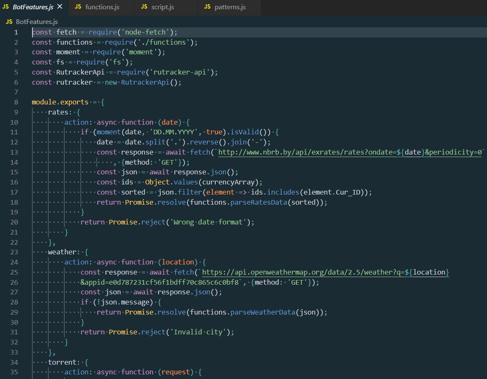

<header class="center"></header>

# Maxim Ostrovsky

 +375255337774  ·   weekofkex@gmail.com  ·   [MadPapaya](https://github.com/MadPapaya)  ·  @DusheGubka 

##  Brief information about me

*   Born 09.02.2001 (20 years old) in Orsha, Belarus (Vitebsk region). Now I study and live in Minsk.
*   My goal and priorities is to become an independent, fully-fledged adult, and, of course, find a dream job. I quickly learn new things and am eager to work (it would be time already).

##  Education

*   Gymnasium № 2 Orsha，2007-2018.
*   Belarusian State University of Radiophysics and Computer Technologies，2018-2022 (expected).
*   **Courses**
    *   All about HTML - layout of sites (Front End) // Freelancer for life;
    *   The Complete JavaScript + React Course - From Scratch to Results // Udemy;

##  Skills

##### Programming Languages

*   **My main programming language is JavaScript.**
    *   <aside>_In fact, I have been teaching him throughout the year, together with HTML and CSS; But laziness has ruined everything, so now I begin with new forces to deeply and irrevocably teach them until I achieve my goals._</aside>

*   Basic knowledge of C++, Python.

Сode examples.
 
 

##### Human Languages

*   Russian (native speaker);
*   English (A2);

<footer>

<article>

##### <mark><time>2001-03-02</time> Publication of resume.</mark>

</article>

>  Information will be updated.

</footer>
